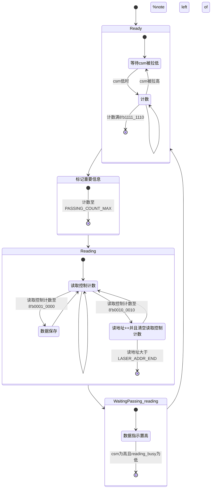

# ZYNQ高速信号采集板说明文档

---

## 零、重要资料参考和提前学习

本文将假定您已经阅读并实践过《启明星ZYNQ之FPGA开发指南》中的FPGA基础操作、《启明星ZYNQ之嵌入式SDK开发指南》中的：*第六章 自定义IP核-呼吸灯实验*、*第十六章 AXI4接口之DDR读写实验*和《启明星ZYNQ之Linux开发指南》中的：*第六章 PetaLinux设计流程实战*和*第二十章 另一种方式编译ZYNQ镜像*。

## 一、FPGA程序部分

FPGA程序由两个IP、一个测试模块和一个组装好的demo构成，分别是ElectronicTarget(电子靶信号采集)、ElectronicTargetAXI4Module(电子靶信号传输至DDR3内存模块)、ElectronicTargetIPtest(电子靶IP测试模块)、axi4_rw_test(总系统)

### ElectronicTarget(电子靶信号采集)

该模块是ZYNQ与信号采集器沟通的桥梁，负责输出AD的时钟信号、电子靶的控制信号、AD转换数据输入和读取到的数据暂存工作。系统运算时钟频率为sys_clk(50Mhz)，故下文中的**计数**部分，一个计数为0.02us。例：计数值达到60，则含义为“当计时到1.2us时”(60 * 0.02us)。

#### 模块接口列表

该模块共有13个接口，其中分为与硬件外设连接、调试信号和AXI4通信模块交互接口三个部分，具体信息如下表。

| 类型 | 名称 | 说明 |
| :--: | :--: | :--: |
|  |      | **激光传感器硬件信号连接** |
| input | sys_clk             | 系统时钟: 50 Mhz |
| input | rst_n | 复位信号 |
| output reg | data_ind        | 数据指示，1时有数据待读取数据 |
| output reg | ad_clk          | ad时钟: 32 Mhz max，实际二分频 |
| output reg | che_out_n       | 低电平AD输出使能 |
| output reg [7:0] | laser_addr | 激光地址输出 |
| input [7:0] | ad_in         | 激光强度AD输入 |
| output| reg sh              | 高电平采样，低电平保持并输出 |
| input | csm                 | 子弹通过时输入低电平 |
| | | **调试信号** |
| output reg [1:0] | state     |调试用，当前状态机状态 |
| | | **AXI4通信模块交互部分** |
| input | reading_busy        | 外部读取时输入高电平 |
| output [7:0] | data_out      |缓存数据输出 |
| input [7:0] | reading_addr   | 缓存数据读取地址输入 |


#### 参数列表


可以看见，只有两个参数，分别是激光传感器的尾地址和一个滤波用的参数。

#### 系统状态机

##### 状态描述

该模块由内部状态机驱动，共划分为4个状态，分别是：

1. READY：模块的入口状态，此时保持外部信号采样，关闭AD输出，数据指示置低。当检测到有子弹通过(CSM被拉低)时开始csm_low计数，当计数值达到8'b1111_1110(254)时进入PASSING状态。计数时，一旦csm被拉高，则终止计数并清空csm_low_count以排除杂波引起采样流程的可能。合适的计数值可以有效防止无用的采样流程。

2. PASSING：子弹通过状态，其功能是等待传感器电容采样至足够水平，同时等待子弹飞过一段时间，减缓“一次子弹通过，多次采样触发”的情况。

3. READING：传感器数据读取状态，此时令采样电容呈保持输出状态，使能AD采样输出，并按地址将传感器的数据存入暂存寄存器中。另外，采样地址递增轮换周期要大于系统时钟周期，采样过快得不到真实数据。实际使用的地址轮换周期是10_0010(34)个时钟周期，同时根据观察，在这34个时钟周期变化内，中位的数据最为准确，故实际采样是在1_0000（具体参考：https://www.wolai.com/iEpGwwARPzy8a82Sji8ERJ#rTth5hmMCdLAHQ3SJhFJ2i）。并会对1_0000前后两个时钟周期的数据一并采样并进行中值滤波。

4. WAITINGPASSING_READING：通知AXI4通信模块读取数据并等待AXI4模块数据读取完成状态。**可以在该状态加一个长时间的延迟来防止短时间内重复触发导致的驱动程序还没读取完毕新的数据就已经覆盖了的问题**，也可以考虑增加中断信号来解决这个问题。

##### 状态转移图



### ElectronicTargetAXI4Module(电子靶数据搬移模块)

该模块为PL与PS之间通信的桥梁，它能够将ElectronicTarget模块暂存在寄存器中的数据转移至挂载在PS端下的DDR3内存中，方便驱动程序读取相关数据。该模块接口数量较大，这里不一一列举，只展示其连接方式。

#### 官方代码与改动简介

该模块基于官方的AXI4_RW_TEST代码修改而来。官方代码实现了接收脉冲输入，以int32数据类型向内存中写入数据（1-4096），再从内存中读取数据，并进行比对，输出比对结果。状态转移图如下：


实际上，在写操作完成之后就可以通过PS端程序在内存中读取了。而我们要做的就是在PS端通过程序读取电子靶的数据，通过研究官方代码，我们可以发现有一个数据生成器（寄存器变量），它会随着写入地址的递增而累加，我们只需要将这个数据生成器替换成我们的数据即可，同时我们还可以去掉读状态和数据比较这两个动作。最终就得到了我们的电子靶数据搬移模块。

有关改动已经在代码中如下标注好了，可以使用`ctrl + f`一键搜索：

```c++
// 注：xxx
```

#### 参数介绍


该模块注意第一二和最后一个参数，分别是写入DDR3内存的首地址、数据传输突发长度和激光传感器数据尾地址。其中第二个参数(数据传输突发长度)注意设置为1，不然会造成数据传输速率不均匀。

#### 不足与改进介绍

1. 数据覆盖问题：当前PL到PS端的通信只是单向通信，只能保证一帧数据被完整地传输至PS端，不能保证PS端完整地取走数据。有可能产生PS还没读取完一帧数据，新的一帧数据又写入内存的情况。目前的解决方案只能是PS端检测到新的数据就使用`memcpy`函数快速将数据搬到另外的buf里做处理。目前这种方式能保证采到50个数据，但将来数据扩充之后的表现就得另做实验了。

   可以考虑的改进：引入中断系统或者是AXI4的read通道，或者是AXI4-Lite操作寄存器标志位来实现双向通信。

2. 数据类型浪费：AXI4官方例程搬运的是int32类型的数据，但我们的AD转化精度只有8位，实际使用的时候相当于只用了32位里的8位，浪费了带宽和储存容量。但是之后拓展到3路数据时，可以把三路数据并成一个24位数据进行统一传输，这样既节省了带宽，也不用写比较复杂的代码，最关键的是这样只需要一个AXI4数据搬运模块就可以了。但是这样操作要考虑到三路数据的同步问题。

### axi4_rw_test(总系统)

这是最终将各个IP和PS连接起来之后的最终工程，通过合理的连接和配置，可以将电子靶的信号采集至DDR3内存。同时还添加了ila调试器，可以在没有上位机的情况下查看电子靶信号采集模块的输出。

#### 连接示意图


该系统实现了基本的ZYNQ PS最小系统以及电子靶模块。

#### 系统配置

系统配置参考《启明星ZYNQ之嵌入式SDK开发指南》中的：*第十六章 AXI4接口之DDR读写实验*。可以参照该章节写一个简单的读取程序，核心代码如下：

```c
char * p_malloc = (char *)0x30000000; //做映射
int *p_tmp = (int *)p_malloc;
if(p_malloc == NULL) {
    print("virtual add is error \n");
}else {
    print("start scan");
    while(1) {
        /***这里是检测有没有新数据，因为激光传感器读数不可能为-1，
        所以每轮结束之后，先将最后一位数据置为-1，当检测到最后一位
        数据不为-1时，说明有新的一帧数据传入***/
        if(*(p_tmp+50)!=-1){
            //处理数据前先快速将数据拷贝到buf里，以防新数据破坏正在使用的数据
            memcpy(inBuf, p_tmp, 4*50);
            for(i=0;i<50;i++){
                print("%d is %d\n", i, inBuf[i]);
            }
            *(p_tmp+50) = -1;
            count++;
        }
    }
}
```

该代码稍加改动就是驱动中的核心代码，能够测试电子靶数据读取系统的工作状况。

## 二、Linux部分

虽然可以使用Vivado的SDK工具简单编写程序读取电子靶的数据，但是对于后续的数据联网上传，UI和调试等等来说还是有一定困难。所以我们在PS端运行一个Linux系统（我用的是ubuntu）就可以使用Linux的生态来加速我们的开发。

PS端Linux系统配置部分十分琐碎，坑也很多，需要读者先完成《启明星ZYNQ之Linux开发指南》中的：*第六章 PetaLinux设计流程实战*和*第二十章 另一种方式编译ZYNQ镜像*中的实验，理解全部流程，并且能够基本将ubuntu系统给跑起来，才能更好的完成项目。

一般流程如下：

> 1. 通过 Vivado 创建硬件平台，得到 hdf 硬件描述文件
> 2. 运行 source <petalinux 安装路径>/settings.sh，设置 Petalinux 运行环境
> 3. 通过 petalinux-create -t project 创建 petalinux 工程
> 4. 使用 petalinux-config --get-hw-description，将 hdf 文件导入到 petalinux 工程当中并配置 petalinux 工程
> 5. 使用 petalinux-config -c kernel 配置 Linux 内核
> 6. 使用 petalinux-config -c rootfs 配置 Linux 根文件系统
> 7. 配置设备树文件
> 8. 使用 petalinux-build 编译整个工程
> 9. 使用 petalinux-package --boot 制作 BOOT.BIN 启动文件
> 10. 制作 SD 启动卡，将 BOOT.BIN 和 image.ub 以及根文件系统部署到 SD 卡中
> 11. 将 SD 卡插入开发板，并将开发板启动模式设置为从 SD 卡启动
> 12. 开发板连接串口线并上电启动，串口上位机打印启动信息，登录进入 Linux 系统

该流程摘自*《启明星ZYNQ之Linux开发指南》6.1 Petalinux 的设计流程概述*，这是构建完整ZYNQ Linux系统的基本流程。由于我们的系统定制化程度较高，实际流程将会与上述流程有所出入，下面将分步骤描述。

### 创建步骤

#### 生成HDF文件

首先打开最终的工程，运行Implementation。完成之后选择File -> Export -> Export Hardware


勾选include bitstream，导出


导出完成后会在工程根目录底下的sdk文件夹里出现一个hdf文件


至此导出hdf文件完成。

#### 配置Petalinux环境变量

这一步让你的终端加载petalinux的环境变量，使之能够运行petalinux的各种脚本和可执行程序。

在你之后要使用的终端里运行：

```bash
source 你的petalinux安装目录/petalinux/2018.3/settings.sh
```

运行完毕后出现如下提示：


之后都要使用这个终端执行petalinux相关的命令，否则要重新执行本步骤

#### 创建 petalinux 工程

最好将工程统一放在一个文件夹里，输入如下命令创建工程：

```bash
petalinux-create -t project --template zynq -n DemoPrj
```

此时会出现一个DemoPrj（可以改成你需要的名字）文件夹，他是我们新建的 petalinux 工程对应的工程目录。

#### 配置工程

首次配置 Petalinux 工程是将 hdf 硬件描述文件文件导入到 Petalinux 工程中，Petalinux 工具会解析 hdf 文件并弹出配置窗口。在终端中输入如下命令配置 Petalinux 工程：

```bash
cd ALIENTEK-ZYNQ
petalinux-config --get-hw-description ../hdf/Phosphor_7020.sdk/  //最后一个参数是.hdf文件所在的位置
```

